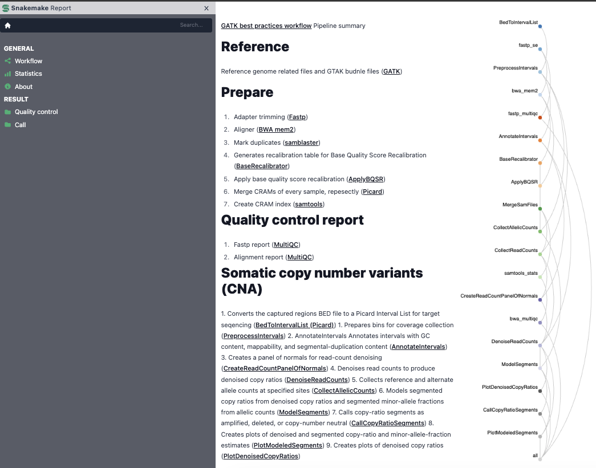
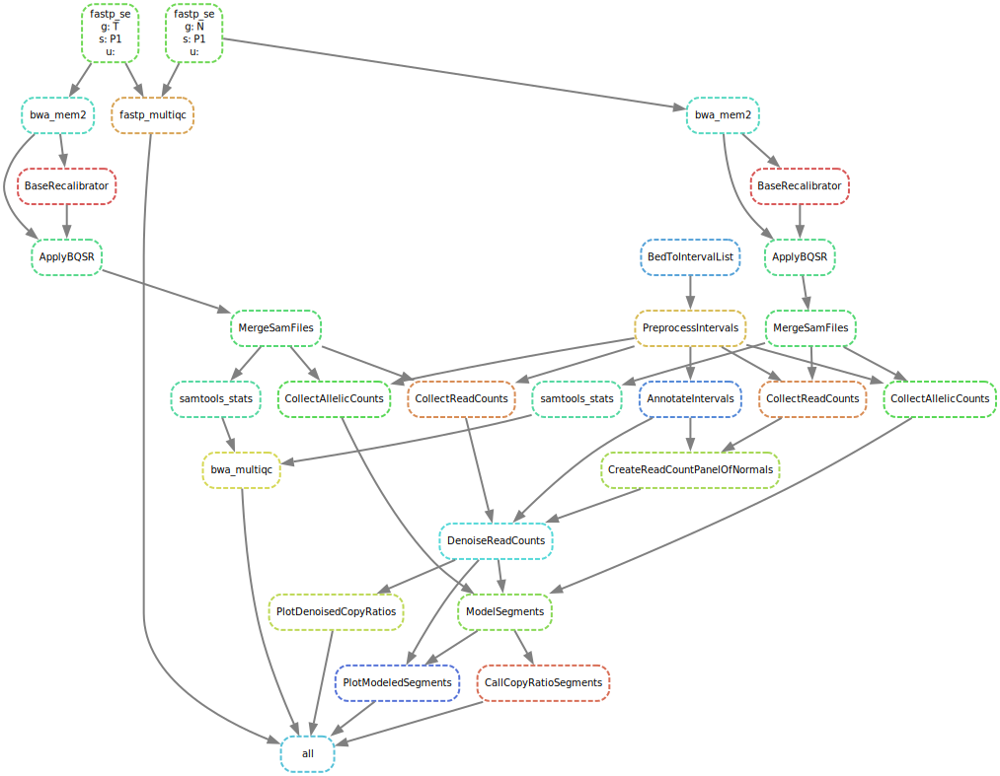

GATK best practices workflow Pipeline summary

SnakeMake Workflow for Human Somatic Copy Number Alteration (CNA)

### Expected fastq inputs

Matched normal and tumor samples.

### Reference

Reference genome related files and GTAK budnle files (GATK)

### Prepare

1. Adapter trimming (Fastp)
2. Aligner (BWA mem2)
3. Mark duplicates (samblaster)
4. Generates recalibration table for Base Quality Score Recalibration (BaseRecalibrator)
5. Apply base quality score recalibration (ApplyBQSR)

### Quality control report

1. Fastp report (MultiQC)
2. Alignment report (MultiQC)

### Call
1. Converts the captured regions BED file to a Picard Interval List for target seqencing (Picard)
1. Prepares bins for coverage collection (PreprocessIntervals)
2. AnnotateIntervals Annotates intervals with GC content, mappability, and segmental-duplication content (AnnotateIntervals)
3. Creates a panel of normals for read-count denoising (CreateReadCountPanelOfNormals)
4. Denoises read counts to produce denoised copy ratios (DenoiseReadCounts)
5. Collects reference and alternate allele counts at specified sites (CollectAllelicCounts)
6. Models segmented copy ratios from denoised copy ratios and segmented minor-allele fractions from allelic counts (ModelSegments)
7. Calls copy-ratio segments as amplified, deleted, or copy-number neutral (CallCopyRatioSegments)
8. Creates plots of denoised and segmented copy-ratio and minor-allele-fraction estimates (PlotModeledSegments)
9. Creates plots of denoised copy ratios (PlotDenoisedCopyRatios)

### SnakeMake Report



### Outputs

```text
├── config
│   ├── captured_regions.bed
│   ├── config.yaml
│   └── samples.tsv
├── dag.svg
├── logs
│   ├── call
│   ├── prepare
│   ├── qc
│   └── trim
├── raw
│   ├── P1.N.fastq.gz
│   └── P1.T.fastq.gz
├── report
│   ├── fastp_multiqc_data
│   ├── fastp_multiqc.html
│   ├── P1.N.fastp.html
│   ├── P1.N.fastp.json
│   ├── P1.T.fastp.html
│   ├── P1.T.fastp.json
│   ├── prepare_multiqc_data
│   └── prepare_multiqc.html
├── report.html
├── results
│   ├── called
│   ├── prepared
│   └── trimmed
├── smk.yaml
└── workflow
    ├── envs
    ├── report
    ├── rules
    ├── schemas
    ├── scripts
    └── Snakefile
```

### Directed Acyclic Graph

